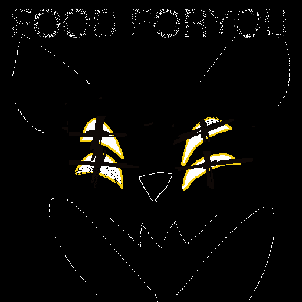

> *This is an unrolled version of this post: <https://bsky.app/profile/hell.hyenas.top/post/3mdrffwr2es2g>*

// fatal vore, memory alteration

Empty street, new moon. You flinch from the sudden sensation of something cold against your shoulder.

«HELLO, MORTAL. WHAT'S YOUR NAME?»

Suddenly, there is a huge horrible slobbering hyena creature walking beside you.

You stammer out, I-I'm «Food»?

The monster's yellow eyes glow, and you decide to entrust it with your name. You can't feel your synapses snapping or rearranging, but your vision goes fuzzy for just a second.

Yeah, I'm Food Foryou, you say.

«WHAT AN UNUSUAL NAME, MISS FORYOU.» Its enormous lips betray smugness.

Huh, so it is.

For the first time, you're struck by the strangeness of it. It's strange that herbivore parents would name their daughter «Food». But that was what you've been called all your life. You can imagine it on your diploma, your driver's license, and all your work emails. «FOOD ALL FORYOU».

The fuck?

Your heart races as you realize the obvious pun. You're a prey mammal named «Food». It's absurd, and borderline offensive. How have you never noticed? You should have changed it years ago. You vividly recall others using it, but never once remarking on it. Shouldn't a pred have bullied you over it?

Did she... do something to you? You scramble for your wallet to check-

«HEY NOW, DON'T PANIC, FOOD. I'M HERE.»

She tenderly coils your wrist with one of her tendrils, and you remember you aren't scared.

«DEEP BREATH. IN, OUT. YOU'RE FOOD.»

Phew. Better. Yeah, you're Food. Always have been.

«YOU'RE TRYING TO GET HOME, RIGHT?»

You nod. You're feeling a little confused, but you're sure that if you can get home it'll be okay.

She picks up your wallet from the ground, squints at your ID with one of her many beautiful yellow eyes, and smiles.

«OH, THEN YOU'RE GOING THE WRONG WAY.»

You look at the street. She's right. You thought you were on the same route you always take, but you've mixed it up somehow.

«WHAT A COINCIDENCE. WE LIVE IN THE SAME BUILDING.»

Really? How convenient.

«YES, SAME UNIT EVEN. HERE, I'LL WALK YOU.»

She scoops you up in your arms, and turns back.

It's strange you haven't met before, since you've been living together in the same apartment for years.

🥀 «YES WE HAVE.»

Right, of course not. Of course, you've met before. How could you forget your wonderful roommate Helliara? You feel ashamed.

I-I'm sorry for forgetting, you blurt out.

🥀 «NO NEED, FOOD. ALL IS WELL, YOU WERE JUST CONFUSED FOR A MOMENT. EVERYTHING WILL MAKE SENSE VERY SOON.»

You're glad to hear that. You're so lucky to have a friend like her in your life. It's so nice being cradled in her arms.

As you arrive home, your other roommate Hollis answers the door.

🐇 "oh, hey Hell. uhh. who's this?" Hollis asks, kind of glaring at Hell.

"Food All Foryou," you declare, confidently.

🥀 «THEY GOT LOST ON THEIR WALK HOME, BUT WERE LUCKY ENOUGH TO BUMP INTO A FAMILIAR FACE.»

🐇 "great..."

Hollis pinches the bridge of their nose, like they always do when they're annoyed. You've secretly always thought this was cute.

🐇 "this is the third time you've pulled that trick this week. you're still digesting the last one."

🥀 «WE'RE SURE WE DON'T KNOW WHAT YOU MEAN.» she smiles.

Hollis jabs your chest with a paw.

🐇 "look dude, idk who you are, but your name's not Food and you don't live here. my... girlfriend is an alien demon wearing the body of my former best friend. she fucked with your memory so she could eat you."

Haha. Pretending not to know you. Classic Hollis.

🥀 «YOU SAID YOU WANTED US TO EAT MORE CONSENTING PREY, RIGHT?» she smiles.

🐇 "we both know that's not what i... ugh. whatever."

Nothing in her inscrutable face changes, but you know this made Hell feels slightly upset and self-conscious. Guess you're just that close.

🥀 «READY, FOOD?»

More ready than you've ever been in your entire-

She sets you down on the couch, and lets go, for just a moment.

The instant it stops touching you, the lies collapse like a house of cards. Thoughts rush to fill the holes left behind. Whiplash. Who-, where-, how...?

Wait, you can only manage to squeal, I'm not Food-!!!

And then the hyena monster swallows you alive, kicking and screaming for your life. Its pet watches your terrified face, your frantically squirming body, go clenching, engulfing, sliding down its throat.

A sick, guilty grin on their face.

Its stomach is strangely luminous, strangely spacious in spite of its tight grip on you. As you plop inside, the beast rips a massive belch—containing most of your oxygen—right in its pet's face. The rabbit just stands there, blushing, drinking the smell right up like a fucking pervert.

You're going to die here. You struggle for your phone and wallet, but that Thing took both of them.

It's little consolation, but at least you remember your actual name. You're Fillis Tummy. You live alone in a building on the corner of Tit Street and Ass Avenue.

🥀 :)

...Gods dammit.

🐇 "did you at least pick up something for me?"

🥀 «IT DROPPED THIS WALLET. YOU COULD DOORDASH SOMETHING?»

🐇 "are you gonna try to eat the driver again?"

🥀 «NOT AS LONG AS THIS ONE IS FILLING ENOUGH.»

🐇 "you're lucky you're hot. and probably fucking my head to make me like you."

It looks offended.

🥀 «PLEASE DON'T JOKE ABOUT THAT, BELOVED HOLLISFREELY. WE WOULD NEVER VIOLATE YOUR AUTONOMY. IT WOULD MAKE YOUR DEVOTION LESS MEANINGFUL.»

🐇 "...thanks?"

🥀 «URP. THE EFFECT DOESN'T LAST VERY LONG ANYWAY.»

Proving its point, you kick furiously from inside its stomach.

🐇 "so i'm, we're, really doing this?"

🥀 «YES. HOWEVER EMBARRASSING YOU MAY FIND IT, YOUR RETURN OF OUR DEEP AND PROFOUND AFFECTION IS ENTIRELY OF YOUR OWN FREE WILL.»

🥀 «IF YOU STOPPED LOVING US, WE WOULD SIMPLY EAT YOU.»

🐇 "oh."

🥀 «SARCASM. WE'VE BEEN PRACTICING. COME RUB, CUTIE PIE.»

🥀 We place an affectionate tendril on the back of the Hollisfreely's neck as they massage the life out of our churning, squirming stomach. Their paws feel so so wonderful against our fat belly. We love them.

🐇 "i love you too, Hell."

🐇 "and uh. please never call me Cutie Pie again."